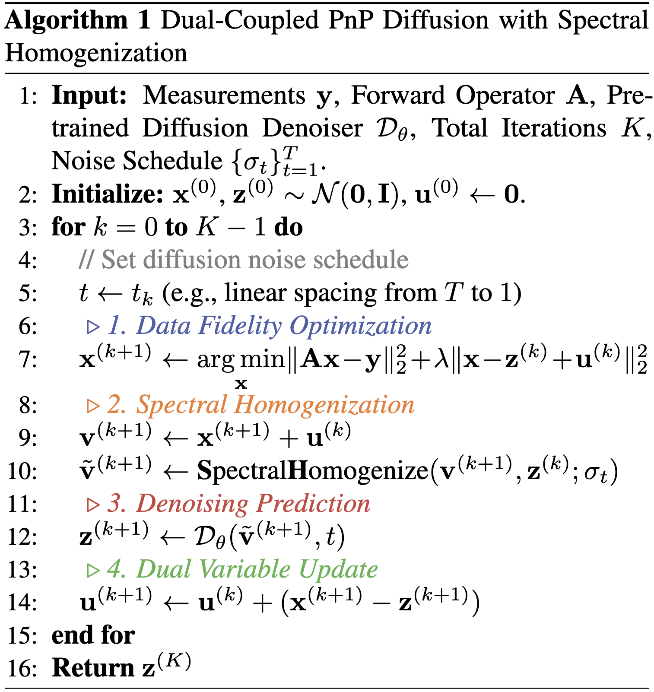

<div align="center">

# 🔄 Plug-and-Play Diffusion Meets ADMM: Dual-Variable Coupling for Robust Medical Image Reconstruction (DC-PnPDP)

<p>
  <a href="https://duchenhe.com/">Chenhe Du</a><sup>1</sup>&nbsp;&nbsp;
  <a href="https://meijitian.github.io/">Xuanyu Tian</a><sup>1</sup>&nbsp;&nbsp;
  <a href="https://iwuqing.github.io/">Qing Wu</a><sup>1</sup>&nbsp;&nbsp;
  <a href="https://scholar.google.com/citations?user=IE-DDTEAAAAJ">Muyu Liu</a><sup>1</sup>&nbsp;&nbsp;
  <br>
  <a href="https://faculty.sist.shanghaitech.edu.cn/yujingyi/">Jingyi Yu</a><sup>1</sup>&nbsp;&nbsp;
  <a href="https://bme.sjtu.edu.cn/Web/FacultyDetail/72">Hongjiang Wei</a><sup>2</sup>&nbsp;&nbsp;
  <a href="https://sist.shanghaitech.edu.cn/zhangyy8/main.htm">Yuyao Zhang</a><sup>1✉️</sup>&nbsp;&nbsp;
</p>

<p>
        <sup>1</sup>ShanghaiTech University &nbsp;&nbsp;&nbsp;
        <sup>2</sup>Shanghai Jiao Tong University &nbsp;&nbsp;&nbsp;
</p>

[](https://openreview.net/forum?id=jEBkuuETjr) [](https://arxiv.org/abs/2602.23214)



</div>


## 📖 Overview

<!--  -->

Plug-and-Play diffusion prior (PnPDP) methods are powerful for solving inverse problems, yet conventional HQS / proximal-style solvers are stateless and can converge to biased solutions under severe measurement corruption. We introduce two complementary ideas:

- 🔗 **Dual-Coupled PnP Diffusion (DCPnPDP)** — reintroduces ADMM dual variables as integral feedback, enforcing stronger measurement consistency throughout the diffusion sampling trajectory.
- 🌈 **Spectral Homogenization (SH)** — transforms structured dual residuals into pseudo-AWGN residuals that match the statistical assumptions of diffusion denoisers, enabling plug-and-play use of off-the-shelf score networks.

This repository provides a complete **parallel-beam CT (PBCT)** reconstruction pipeline built on these two components, with NIfTI I/O and quantitative evaluation (PSNR / SSIM / LPIPS) included.

## 🗂️ Repository Structure

```text
.
├── algorithms/        # DCPnPDP, DiffPIR, SH, and base sampler
├── checkpoints/       # Pretrained model checkpoints (not included; see checkpoints/CHECKPOINTS.md)
├── physics/           # CT forward / adjoint / FBP operators (PBCT)
├── utils/             # Argument parsing, data I/O, metrics, scheduler
├── torch_utils/       # Auxiliary modules from the EDM codebase
├── recon_PBCT.py      # Main reconstruction entry point
└── recon_PBCT.sh      # Example run script
```

## 🛠️ Installation

**Requirements:**

```bash
# PyTorch — match the command to your CUDA version (https://pytorch.org)
pip install torch torchvision

# General dependencies
pip install numpy pyyaml tqdm requests SimpleITK torchmetrics lpips

# CT operators — install according to your CUDA setup
# torch-radon    (https://github.com/carterbox/torch-radon)
```

## 🤖 Pretrained Checkpoint

We provide a pretrained unconditional diffusion model (trained on 100K+ abdominal CT slices) to support reproducibility and follow-up research. See [`CHECKPOINTS.md`](./checkpoints/CHECKPOINTS.md) for the download link and training details.

Place the downloaded `.pkl` file at a path of your choice (e.g., `./checkpoints/edm/network-snapshot-003882.pkl`) and update `recon_PBCT.sh` accordingly.

## 📂 Data Preparation

Input volumes should be 3D NIfTI files (`.nii` / `.nii.gz`). The example script uses:

```
./data/AbdomenCT-1K/valid/Case_00066_0000.nii.gz
```

Neither dataset files nor checkpoints are included in this repository. Please obtain and place them manually.

## 🚀 Quick Start

**Option A — shell script (recommended for first run):**

```bash
bash recon_PBCT.sh
```

Edit the variable block at the top of `recon_PBCT.sh` to set your data path, checkpoint path, method, and task.

**Option B — direct Python call:**

```bash
python recon_PBCT.py \
  --method DCPnPDP \
  --task SVCT \
  --degree 20 \
  --gpu 0 \
  --data /path/to/volume.nii.gz \
  --slice-begin 0 --slice-end 500 --slice-step 10 \
  --recon-size 256 \
  --NFE 50 \
  --num-cg 50 \
  --w-tik 0 \
  --use-init True \
  --sigma-max 2 \
  --checkpoint-path /path/to/network-snapshot.pkl \
  --save_dir ./results/
```

## ⚙️ Key Arguments

| Argument | Description | Example |
|---|---|---|
| `--method` | Reconstruction algorithm | `DCPnPDP`, `DiffPIR`, `edm` |
| `--task` | CT degradation type | `SVCT`, `LACT` |
| `--degree` | SVCT: number of views; LACT: angular range (°) | `20`, `90` |
| `--data` | Input NIfTI volume | `/path/to/case.nii.gz` |
| `--slice-begin/end/step` | Slice range within the 3D volume | `0 / 500 / 10` |
| `--recon-size` | Reconstruction resolution (square) | `256` |
| `--NFE` | Number of diffusion function evaluations | `50` |
| `--num-cg` | Conjugate gradient iterations per step | `50` |
| `--w-tik` | Tikhonov regularization weight | `0`, `1e-3` |
| `--sigma-max` | Maximum noise level for diffusion sampling | `2` |
| `--checkpoint-path` | Path to pretrained `.pkl` checkpoint | *(required)* |
| `--save_dir` | Root directory for outputs | `./results/` |

**Sinogram noise** (`--sino-noise`): `0` = none; `< 100` = Gaussian (std = sqrt(value)); `≥ 100` = Poisson-like.

## 📤 Outputs

Results are saved to a timestamped subdirectory:

```
<save_dir>/<case>/<task>-<degree>/<method>/<YYMMDD_HHMMSS>/
```

| File | Description |
|------|-------------|
| `args.yaml` | Full configuration snapshot |
| `GT.nii.gz` | Ground-truth volume |
| `measurement.nii.gz` | Sinogram / degraded measurement |
| `FBP-FV.nii.gz` | Full-view FBP reference |
| `FBP-LV.nii.gz` | Limited-view FBP baseline |
| `CG-LV.nii.gz` | CG baseline |
| `recon.nii.gz` | Method reconstruction |
| `recon_metrics/` | `metrics_summary.yaml`, error maps |

## 📚 Citation

If you find this work useful, please cite:

```bibtex
@inproceedings{du2026dcpnpdp,
  title   = {Plug-and-Play Diffusion Meets ADMM: Dual-Variable Coupling for Robust Medical Image Reconstruction},
  author  = {Du, Chenhe and Tian, Xuanyu and Wu, Qing and Liu, Muyu and Yu, Jingyi and Wei, Hongjiang and Zhang, Yuyao},
  journal = {Forty-third International Conference on Machine Learning},
  year    = {2026},
  url     = {https://openreview.net/forum?id=jEBkuuETjr},
}
```
